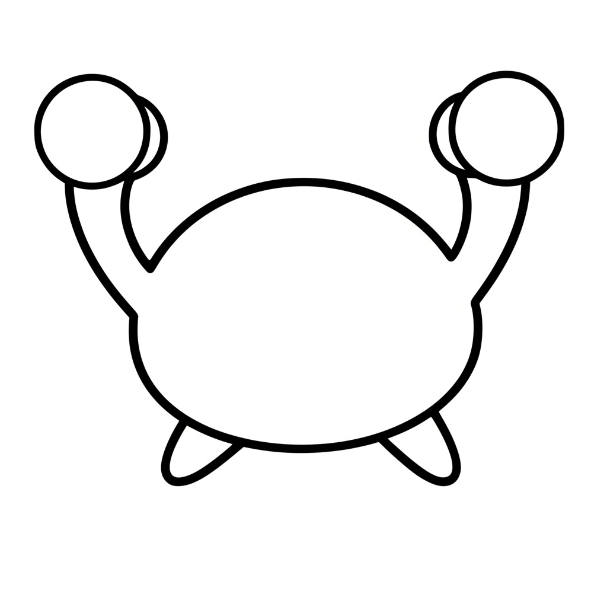
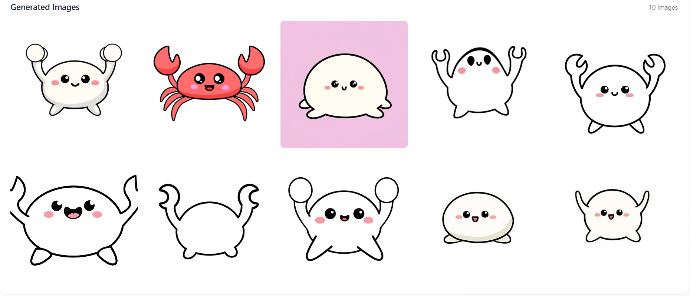

# Sticker Atelier (ステッカーアトリエ)

[](media/logo1.svg)

This project is an innovative AI image generation application that allows you to create new images by combining a base character image, a pose reference image, and a text prompt. It leverages Google's powerful generative AI to bring your ideas to life with unprecedented control and creativity.

Base image:


Pose image:


Generated images:


## 💡 Concept: Deepen Bonds by Co-creating LINE Stickers

This application is more than just an image generation tool. It's an MVP (Minimum Viable Product) for a hackathon, designed with the goal of **"revitalizing communication and deepening relationships as friends and couples create LINE stickers together."**

By using a common character (base image) to generate images in various poses and situations, users can enjoy turning their shared memories and inside jokes into stickers. Future plans include implementing a project-sharing feature, a key part of the "Future Roadmap," to enable real-time collaboration.

## ✨ Key Features

- **Character-Preserving Generation:** Generate images of a specific character (from the base image) in various contexts.
- **Pose Replication:**  Accurately replicate the pose from a reference image onto your character.
- **Prompt-Driven Scenarios:** Describe the scene, style, and action with a text prompt to guide the AI.
- **Batch Generation:** Create up to 10 image variations at once, giving you a wide range of options.
- **Intuitive UI:** A clean and user-friendly interface built with React, TypeScript, and Tailwind CSS.
- **Powered by Google AI:** Utilizes the latest models from Google for high-quality image generation.

## 🛠️ Tech Stack

- **Frontend:** React, TypeScript, Vite
- **Styling:** Tailwind CSS
- **AI:** Gemini 2.0 Flash Preview Image Generation
- **Icons:** Lucide React

## 💻 Development Environment

This project was developed using **Cline** with **gemini-2.5-pro-preview-05-06** and **bolt.new**.

## 🚀 Getting Started

### Prerequisites

- Node.js (v18 or later)
- A Google AI API Key

### Installation & Setup

1.  **Clone the repository:**
    ```bash
    git clone https://github.com/takaT-toho/sticker-atelier.git
    cd sticker-atelier
    ```

2.  **Install dependencies:**
    ```bash
    npm install
    ```

3.  **Set up environment variables:**
    Create a `.env` file in the root of the project and add your Google AI API key:
    ```
    VITE_GEMINI_API_KEY=YOUR_GOOGLE_AI_API_KEY
    ```

4.  **Run the development server:**
    ```bash
    npm run dev
    ```
    The application will be available at `http://localhost:5173` (or another port if 5173 is in use).

## 🔮 Future Roadmap

- [ ] Allow dynamic configuration of the number of images to generate.
- [ ] Implement login functionality.
- [ ] Create user-specific projects where the base image can be changed per project.
- [ ] Allow selecting pose images from a gallery of samples.
- [ ] Dynamically generate text prompts from natural language input.
- [ ] Allow switching between different AI image generation models.
- [ ] Add a feature to save and manage favorite generated images.
- [ ] Enable project sharing and collaboration between multiple users.
- [ ] Add a text insertion feature to finalize LINE stickers.
- [ ] Implement a background removal/transparency feature.
